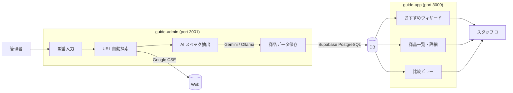

# Guide App


## Overview

家電スタッフがタブレットで使える商品案内・比較サポートアプリ。
管理者が型番を入力するだけで AI が商品情報を自動抽出し、スタッフアプリにリアルタイム反映されます。

<!-- TODO: スクリーンショット追加 -->

---

## Features

| | 機能 | 説明 |
|---|---|---|
| ✅ | AI 商品自動登録 | URL を入力するだけでスペック・販売トークを自動抽出 |
| ✅ | 横並び比較ビュー | 複数商品をカード形式で比較、差別化ポイントを表示 |
| ✅ | おすすめウィザード | お客様の条件をステップ形式でヒアリングして商品を提案 |
| ✅ | バッチ登録 | 複数商品を一括キューで順次処理 |
| ✅ | 色展開取得 | table / dl / img alt など複数戦略でカラーバリエーションを自動取得 |
| ✅ | PWA 対応 | iPad ホーム画面追加でアプリライクに動作 |
| ✅ | AI プロバイダー切り替え | Gemini / Ollama をenv 変数 1 つで切り替え |
| 🔲 | オフラインキャッシュ | Service Worker でキャッシュ、圏外でも閲覧可能 |
| 🔲 | ダッシュボード統計 | カテゴリ別登録数・更新履歴のサマリー表示 |

---

## Tech Stack

| Category | Technology | Reason |
|---|---|---|
| Frontend | Next.js 16 / TypeScript | App Router + RSC で高速レンダリング |
| Styling | Tailwind CSS v4 | ユーティリティファーストで迅速な UI 構築 |
| Backend / DB | Supabase (PostgreSQL + RLS) | 認証・リアルタイム同期・ストレージを一元管理 |
| AI Extraction | Gemini 2.5 Flash | 高精度なスペック抽出と販売トーク生成 |
| Local AI | Ollama (Gemma 等) | コスト削減・オフライン推論のフォールバック |
| URL Discovery | Serper.dev API | メーカー公式ページの自動探索 |
| QR Code | qrcode.react | スタッフ間の商品リンク共有 |
| Deploy | Vercel | push で自動デプロイ・Preview URL 付き |

---

## Architecture



---

## Getting Started

### Prerequisites

- Node.js 18+
- [Supabase](https://supabase.com) project (free tier 可)
- Gemini API key ([Google AI Studio](https://aistudio.google.com))
- Serper.dev API key ([serper.dev](https://serper.dev))

### guide-app — Staff App

```bash
cd guide-app
npm install
```

`.env.local` を作成:

```env
NEXT_PUBLIC_SUPABASE_URL=your_supabase_url
NEXT_PUBLIC_SUPABASE_ANON_KEY=your_supabase_anon_key
```

```bash
npm run dev   # http://localhost:3000
```

### guide-admin — Admin App

```bash
cd guide-admin
npm install
```

`.env.local` を作成:

```env
NEXT_PUBLIC_SUPABASE_URL=your_supabase_url
NEXT_PUBLIC_SUPABASE_ANON_KEY=your_supabase_anon_key
SUPABASE_SERVICE_ROLE_KEY=your_service_role_key
GEMINI_API_KEY=your_gemini_api_key
SERPER_API_KEY=your_serper_api_key
NEXT_PUBLIC_SUPER_ADMIN_EMAIL=your_admin_email

# Optional: AI provider (default: gemini)
# AI_PROVIDER=ollama
# OLLAMA_BASE_URL=http://localhost:11434/v1
# OLLAMA_MODEL=gemma4:e4b
```

```bash
npm run dev   # http://localhost:3001
```

### Supabase Tables

主要テーブル: `products` / `categories` / `product_specs` / `product_comparisons` / `wizard_scores` / `url_candidates`

詳細は [`docs/guide-admin-guide.md`](docs/guide-admin-guide.md) を参照してください。

---

## Implementation Notes

- **スペック抽出パイプライン**
  HTML 取得 → スクリプト/スタイル除去 → テキスト化 → AI プロンプト → JSON パース の多段処理。メーカーによっては公式 JSON spec API が存在するため、そちらを優先利用（例: 日立 kadenfan spec API）。

- **RLS によるアクセス制御**
  Supabase の Row Level Security で管理者のみ書き込み可能。スタッフアプリは anon key で読み取り専用。サービスロールキーはサーバーサイド API Route のみで使用。

- **AI プロバイダー抽象化**
  `ai-client.ts` で Gemini / Ollama を統一インターフェースに集約。環境変数 `AI_PROVIDER` 1 つで切り替え可能。ローカル環境ではコスト 0 で動作確認が可能。

- **色展開の多段フォールバック**
  table / dl / カラー UI コンテナ / img alt / カラーコードパターン の順に検索。メーカーごとの DOM 差異を吸収する。

- **比較データの双方向マッチング**
  `product_comparisons` テーブルで型番を正規化し、A→B / B→A の双方向で自動取得。

---

## Roadmap

- [ ] ダッシュボード — カテゴリ別登録数・更新履歴の統計表示
- [ ] オフライン対応 — Service Worker によるキャッシュ、圏外でも商品一覧を閲覧可能に
- [ ] 初回ガイドフロー — 新規ユーザー向けオンボーディング UI
- [ ] 機能説明画像 — 各機能ページにスクリーンショット・図解を追加
- [ ] ウィザードのスコアリング精度向上 — 条件ヒアリングロジックの改善

---

## License

© 2026 Haruto Miyakawa — All Rights Reserved.
